# VoltStream — проектирование и расчёт электрических схем

**VoltStream** — веб-приложение на Django для построения, хранения и ведения электрических схем распределительных сетей. Проект включает интерактивный графический редактор схем, каталоги оборудования (трансформаторы, линии, потребители), систему версионирования (ревизии схем), разграничение доступа по организациям и ролям, а также собственную админ‑панель для администраторов организаций поверх стандартной админки Django.

> **Внимание к версиям:** Актуальная версия проекта находится в ветке **`main`**. Запуск проекта осуществляется после скачивания именно из этой ветки.

---

## Оглавление

1. [Технологический стек](#1-технологический-стек)
2. [Структура проекта и модель данных](#2-структура-проекта-и-модель-данных)
3. [Инструкция по локальному запуску (через PyCharm)](#3-инструкция-по-локальному-запуску-через-pycharm)
4. [Управление доступом: Роли и две админ-панели](#4-управление-доступом-роли-и-две-админ-панели)
5. [Работа с базой данных (Django Admin)](#5-работа-с-базой-данных-django-admin)
6. [Графический редактор и REST-API](#6-графический-редактор-и-rest-api)
7. [Справочники и импорт данных](#7-справочники-и-импорт-данных)
8. [Известные особенности и частые проблемы](#8-известные-особенности-и-частые-проблемы)
9. [Подробная архитектура и структура проекта](#9-подробная-архитектура-и-структура-проекта)

---

## 1. Технологический стек

| Компонент          | Значение                                      |
|--------------------|---------------------------------------------|
| Python             | 3.13 (совместимо с 3.10+)                   |
| Django             | 6.0.3                                       |
| База данных        | SQLite (`db.sqlite3` в корне репозитория)   |
| Frontend           | HTML + CSS + ванильный JavaScript (`app.js`) |
| Импорт данных      | `pandas` (команда `import_from_excel`)      |
| Локализация        | `ru-ru`, TZ `Europe/Minsk`                  |

*Отдельного Node/React‑билда проект не требует. Встроенный сервер разработки Django используется как для фронтенда, так и для API.*

---

## 2. Структура проекта и модель данных

### Основные директории
* `manage.py` — точка входа Django.
* `db.sqlite3` — готовая БД с демо‑данными (справочники уже наполнены).
* `voltstream_project/` — конфигурация Django‑проекта (настройки, корневые URL).
* `designer/` — основное приложение (модели, views, API, статика, шаблоны).

### Модель данных (`designer/models/`)

1. **Организационные объекты (`core.py`):** `Organization` (владелец схем), `Role`, `UserProfile` (расширение штатного User: отчество, телефон, привязка к организации), `AuditLog`.
2. **Схемы и папки (`schemes.py`):** `Folder` (древовидная структура), `Scheme`, `SchemeRevision` (хранит `topology_data` в формате JSON для версионирования).
3. **Расчёты (`calculations.py`):** `Scenario`, `Run`.
4. **Справочники (`references.py`):** `RefTransformer`, `RefLine`, `RefConsumerType`. В поставляемой БД уже 78 трансформаторов и 6 632 линии.
   
---

## 3. Инструкция по локальному запуску (через PyCharm)

Ниже описаны шаги для запуска проекта на локальном сервере с использованием среды разработки PyCharm.

### Шаг 3.1: Открытие проекта и выбор ветки
1. Запустите **PyCharm**.
2. Выберите `File` -> `Open...` и укажите корневую папку проекта (где лежит файл `manage.py`).
3. Дождитесь индексации файлов.
4. Убедитесь, что вы находитесь в ветке **`main`** (именно там находится актуальная версия). При необходимости переключитесь на нее через встроенный Git в PyCharm или команду в терминале: `git checkout main`

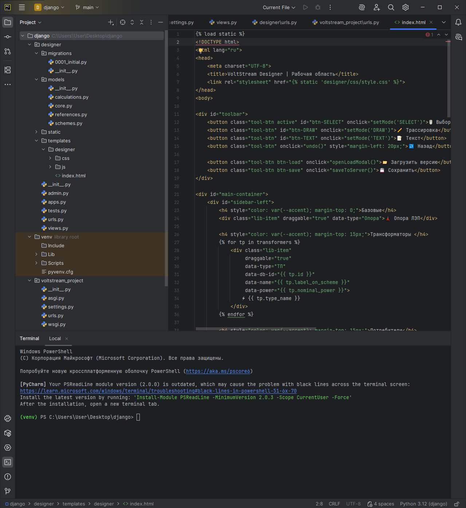

### Шаг 3.2: Открытие терминала
Используйте сочетание клавиш `Alt + F12` или нажмите на вкладку **Terminal** на нижней панели PyCharm. Убедитесь, что вы находитесь в корне проекта.

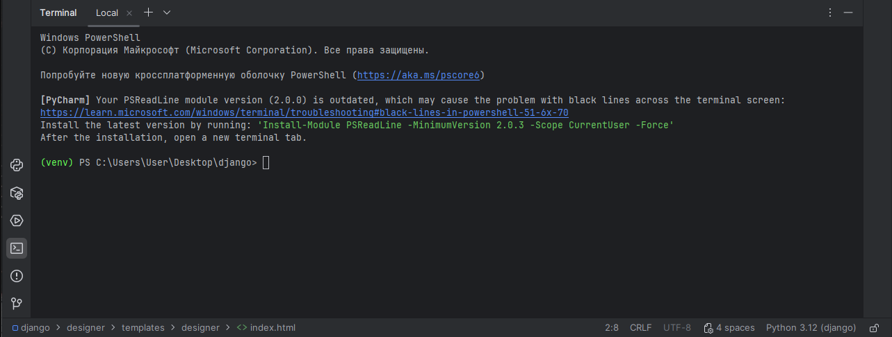

Ниже приведён доработанный фрагмент **раздела 3.3** с использованием `requirements.txt`. Вставьте его в README вместо текущего текста про виртуальное окружение и зависимости. Также добавлен совет по `.gitignore`, чтобы не загружать `venv/` в репозиторий.

---

### Шаг 3.3: Виртуальное окружение и зависимости

Зависимости проекта описаны в файле `requirements.txt`. Рекомендуется создать новое виртуальное окружение и установить пакеты из этого файла. Папка `venv/` не должна попадать в Git — добавьте её в `.gitignore`.

1. Создайте виртуальное окружение в корне проекта:
   ```bash
   py -m venv venv
   ```
2. Активируйте его:
   - **Windows (PyCharm Terminal):**  
     ```bash
     venv\Scripts\activate
     ```
   - **macOS / Linux:**  
     ```bash
     source venv/bin/activate
     ```
3. Установите все зависимости одной командой:
   ```bash
   pip install -r requirements.txt
   ```

Если по какой-то причине `requirements.txt` отсутствует, создайте его в корне проекта со следующим содержимым:
```
Django==5.2.13
asgiref==3.11.1
sqlparse==0.5.5
tzdata==2024.2

pandas==2.2.3
numpy==2.1.1
python-dateutil==2.9.0.post0
pytz==2024.2
six==1.16.0

openpyxl==3.1.5
et-xmlfile==2.0.0

```
и затем выполните установку как показано выше.

---

### Шаг 3.4: Запуск локального сервера
Если используется пустая БД, примените миграции командой `py manage.py migrate`. Если используете демо-БД (`db.sqlite3`), миграции уже применены. Запустите сервер:
```bash
py manage.py runserver
```
Дождитесь сообщения об успешном старте.

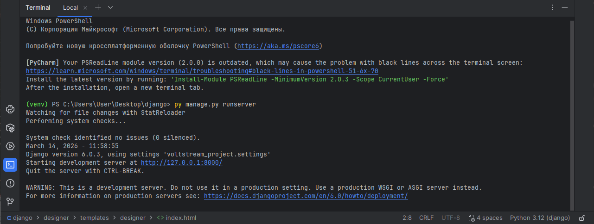

### Шаг 3.5: Переход в интерфейс
В терминале зажмите **Ctrl** и кликните левой кнопкой мыши по ссылке `http://127.0.0.1:8000/`. Проект откроется в браузере (главная страница — графический редактор схем).

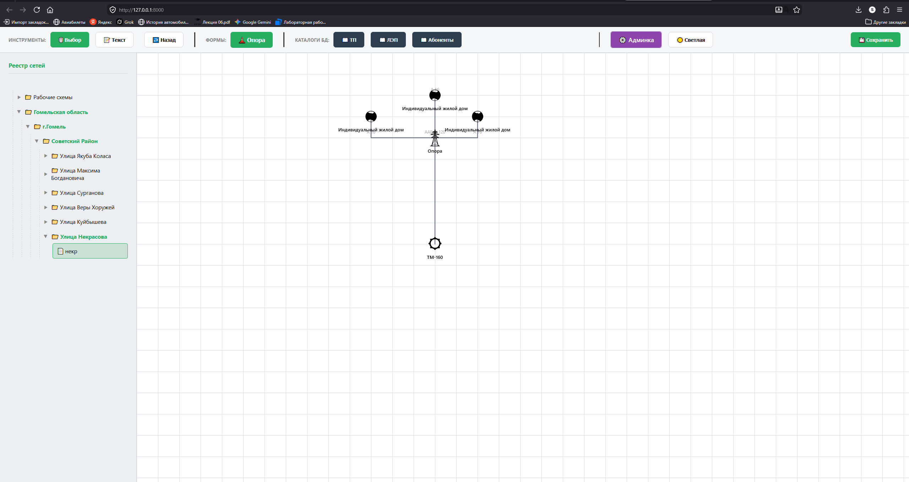

  
*(Внешний вид основного рабочего пространства графического редактора)*

---

## 4. Управление доступом: Роли и две админ-панели

В проекте реализовано **три типа пользователей** с разным уровнем доступа и две раздельные панели администратора.

### Типы пользователей

1. **Супер-администратор (Super Admin):**
   * **Права:** Полный доступ ко всей системе (`is_superuser=True`, `is_staff=True`).
   * **Доступ:** Видит данные всех организаций в стандартной админке (`/admin/`) и в кастомной панели (`/admin-panel/`).
2. **Администратор организации (Admin):**
   * **Права:** Управляет только своей организацией (`is_superuser=False`, `is_staff=True`).
   * **Доступ:** Имеет доступ в кастомную админ-панель (`/admin-panel/`) для управления справочниками, схемами и пользователями *исключительно своей* организации.
3. **Обычный пользователь (Инженер):**
   * **Права:** Базовые права для работы с редактором (`is_superuser=False`, `is_staff=False`).
   * **Доступ:** Имеет доступ только к главной странице (графическому редактору схем `/`). При попытке входа в любую из админ-панелей получит сообщение «Доступ запрещён».

### Доступные панели управления

| Панель                           | URL                                | Права доступа                    | Описание |
|----------------------------------|------------------------------------|----------------------------------|----------|
| **Стандартная Django Admin** | `http://127.0.0.1:8000/admin/`     | `is_staff=True`                  | Техническое управление. Полный контроль над таблицами. |
| **Кастомная панель VoltStream** | `http://127.0.0.1:8000/admin-panel/` | `is_superuser` или `is_staff`    | Индивидуальный UI для администраторов (управление организацией). |

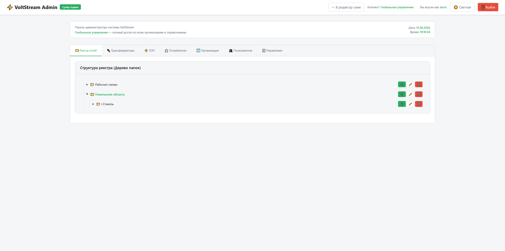  
*(Интерфейс кастомной панели администрирования VoltStream)*

### Примеры создания пользователей

**1. Создание Супер-администратора (через терминал)**
*(В поставляемой демо-БД уже есть супер-админ с логином `admin` и паролем `admin123`)*
1. Остановите сервер в терминале (`Ctrl + C`).
2. Выполните команду: `py manage.py createsuperuser`.
3. Последовательно заполните логин, email (можно пропустить) и пароль (символы скрыты при вводе).

**2. Создание Администратора организации (через Django Admin)**
1. Войдите в стандартную админку (`/admin/`) под учетной записью супер-админа.
2. Перейдите в раздел **Users** и нажмите **Add user**. Укажите логин и пароль, нажмите `Save and continue editing`.
3. В блоке *Permissions* поставьте галочку **Staff status** (разрешает вход в панель). Галочка *Superuser status* должна быть **СНЯТА**. Сохраните.
4. Перейдите в раздел **User profiles**, найдите профиль только что созданного пользователя и в поле *Organization* выберите организацию, которой он будет управлять.

**3. Создание Обычного пользователя (Инженера)**
* **Способ 1 (Удобный):** Администратор организации заходит в кастомную панель (`/admin-panel/`), переходит в раздел "Пользователи" и создает нового инженера. Система сама привяжет его к нужной организации без лишних прав.
* **Способ 2 (Через Django Admin):** Аналогично созданию администратора (раздел *Users*), но в блоке *Permissions* галочки **Staff status** и **Superuser status** должны быть строго **СНЯТЫ**. Затем профиль также нужно привязать к организации через раздел *User profiles*.

---

## 5. Работа с базой данных (Django Admin)

Для глубокой настройки данных используется стандартная панель администратора:
1. Перейдите на `http://127.0.0.1:8000/admin/` и авторизуйтесь.

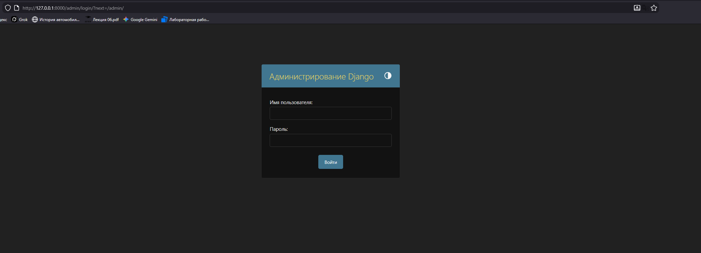

2. Откроется список всех моделей базы данных.

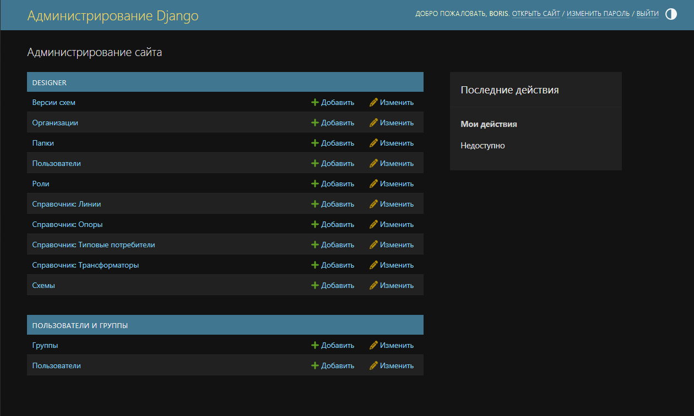

* **Добавление (`Add`):** Нажмите кнопку Add рядом с нужной моделью. Заполните форму и сохраните.
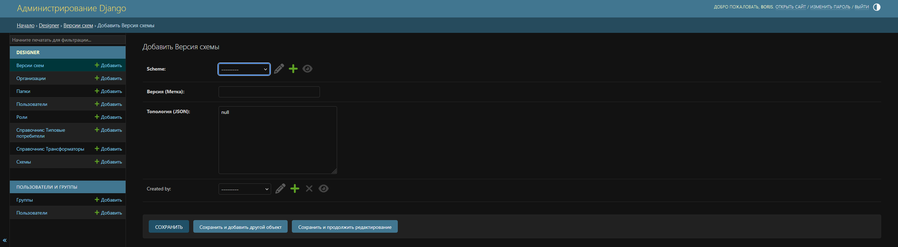

* **Редактирование:** Выберите нужную запись, внесите изменения и нажмите Save.
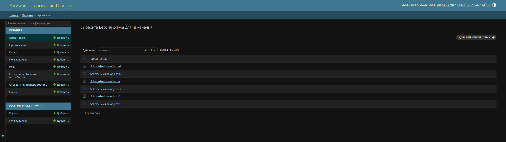

* **Удаление:** Выделите записи галочкой, в меню Action выберите `Delete selected...` и нажмите Go.
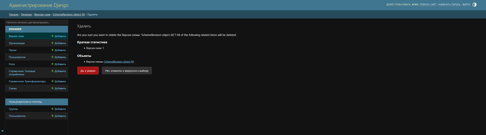

---

## 6. Графический редактор и REST-API

Главная страница (`/`) представляет собой рабочее пространство инженера (`designer/static/designer/js/app.js`). 
Сценарий использования:
1. Выбор оборудования из каталога (модальное окно: `templates/designer/catalog_modal.html`).
2. Размещение узлов (ТП, ЛЭП, Абонент) на холсте.
3. Сохранение: топология отправляется JSON-объектом на эндпоинт `/api/save/` и становится новой `SchemeRevision`.

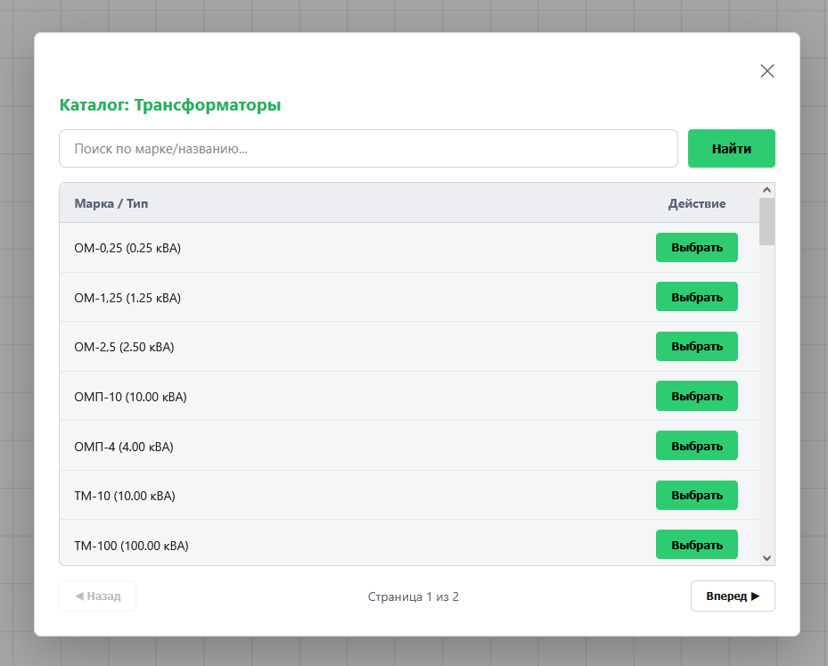  
*(Каталог выбора трансформаторов)*

### Основные API-маршруты
* `/api/save/` (POST) — сохранить топологию.
* `/api/load/<rev_id>/` (GET) — загрузить конкретную ревизию.
* `/get_catalog_nodes/` (GET) — пагинированный список оборудования для каталога.
* Все CRUD-эндпоинты кастомной панели префиксованы `/api/admin/` (например, `/api/admin/transformers/`).

---

## 7. Справочники и импорт данных

В репозитории есть встроенная команда для массового импорта справочников (требует библиотеки `pandas` и `openpyxl`):

```bash
py manage.py import_from_excel --lines Lines_VL+KL.xlsx --transformers Transformers.xlsx
```
*Примечание: Если вы используете демо-файл `db.sqlite3`, справочники уже загружены, повторный импорт не требуется.*

---

## 8. Известные особенности и частые проблемы

### Особенности для Production
* В `settings.py` установлен `DEBUG = True` и тестовый `SECRET_KEY`. Это небезопасно. Для релиза смените ключ, выключите DEBUG и настройте `ALLOWED_HOSTS`.
* Некоторые эндпоинты имеют декоратор `@csrf_exempt` для удобства локальной разработки. В production включите CSRF-защиту.
* Папки `__pycache__` и `venv/` могут присутствовать в репозитории, при необходимости добавьте их в `.gitignore`.

### Частые проблемы

* **`ModuleNotFoundError: No module named 'django'`**
  Не активировано виртуальное окружение. Выполните `venv\Scripts\activate`.
* **`no such table: ...`**
  Отсутствует база данных или не применены миграции. Выполните `py manage.py migrate`.
* **Не открывается `/admin-panel/`, редирект на логин**
  Вы не авторизованы или не имеете прав `is_staff`.
* **`/admin-panel/` показывает «Доступ запрещён»**
  У вас есть аккаунт, но нет прав `is_staff` / `is_superuser`. Зайдите через стандартную админку `/admin/` и выдайте права.
* **Падает импорт из Excel**
  Убедитесь, что в виртуальном окружении установлены `pandas` и `openpyxl`.

---

## 9. Подробная архитектура и структура проекта

### Дерево файлов
```text
Проект/
├── manage.py                      # стандартный Django CLI
├── db.sqlite3                     # локальная БД (в репозиторий не коммитим)
├── start.bat                      # быстрый запуск dev-сервера
├── README.md                      # этот файл
│
├── voltstream_project/            # настройки Django-проекта
│   ├── __init__.py
│   ├── settings.py
│   ├── urls.py                    # корневой роутинг (включает designer/urls.py)
│   ├── wsgi.py
│   └── asgi.py
│
└── designer/                      # основное приложение
    ├── __init__.py
    ├── admin.py                   # регистрация моделей в Django admin
    ├── apps.py
    ├── tests.py
    ├── urls.py                    # все маршруты приложения (editor, admin-panel, API)
    │
    ├── management/                # кастомные manage.py-команды
    │
    ├── migrations/                # миграции БД (0001_initial … 0009_*)
    │
    ├── models/                    # ПАКЕТ моделей (разбит по доменам)
    │   ├── __init__.py            # реэкспорт всех моделей
    │   ├── core.py                # Organization, Role, UserProfile, AuditLog
    │   ├── references.py          # RefTransformer, RefLine, RefConsumerType
    │   ├── schemes.py             # Folder, Scheme, SchemeRevision
    │   └── calculations.py        # будущие расчётные модели
    │
    ├── views/                     # ПАКЕТ представлений (разбит по доменам)
    │   ├── __init__.py            # реэкспорт всех функций — urls.py работает как раньше
    │   ├── base.py                # декораторы, утилиты, базовый класс CrudView
    │   ├── pages.py               # editor_view, admin_panel_view, logout_view
    │   ├── schemes.py             # save/list/load ревизий, CRUD папок и схем
    │   ├── catalog.py             # get_catalog_nodes, get_node_details
    │   ├── admin_transformers.py  # CRUD RefTransformer (через TransformerCrud)
    │   ├── admin_lines.py         # CRUD RefLine (через LineCrud)
    │   ├── admin_consumers.py     # CRUD RefConsumerType (через ConsumerCrud)
    │   ├── admin_organizations.py # CRUD Organization (+ api_create_organization)
    │   └── admin_users.py         # CRUD User + UserProfile (+ api_create_user)
    │
    ├── static/designer/
    │   ├── css/
    │   │   └── style.css          # тёмная/светлая темы, все стили редактора
    │   ├── icons/                 # SVG-иконки для редактора (tp, pole, home)
    │   └── js/                    # МОДУЛЬНЫЙ фронтенд редактора
    │       ├── state.js           # window.App.state — единое хранилище
    │       ├── api.js             # class ApiClient — обёртка над fetch
    │       ├── canvas.js          # class CanvasView — геометрия, zoom/pan
    │       ├── nodes.js           # class NodeManager — узлы, drag-and-drop
    │       ├── lines.js           # class LineManager — ЛЭП и их ручки
    │       ├── properties.js      # class PropertyPanel — правый сайдбар
    │       ├── catalog.js         # class CatalogModal — окно справочника
    │       └── main.js            # точка входа + обработчики мыши/клавиатуры
    │
    └── templates/designer/
        ├── index.html             # главная страница редактора схем
        ├── admin_panel.html       # административная панель
        └── catalog_modal.html     # переиспользуемое модальное окно каталога
```

### Архитектура бэкенда

- **Базовый слой (`base.py`)**: Содержит общие инструменты форматирования JSON, парсинга тела запроса, проверки прав доступа (`staff_required`, `superuser_required`, `require_methods`).
- **Слой ООП (`CrudView`)**: Универсальный базовый класс для генерации CRUD-эндпоинтов, позволяющий декларативно описывать работу со справочниками (указание полей для чтения/записи и сортировки).
- **Пакет `views`**: Серверный код разбит на тонкие доменные модули. Реэкспорт через `__init__.py` обеспечивает обратную совместимость с `urls.py`.
- **Пакет `models`**: Модели сгруппированы по доменам (`core.py`, `references.py`, `schemes.py`, `calculations.py`) и реэкспортируются в `__init__.py`.

### Архитектура фронтенда

Редактор реализован на чистом JavaScript (ES2020) без сборщика. Весь код живет в едином пространстве `window.App`.
Подключение скриптов в `index.html` идет строго по порядку:
1. `state.js` — инициализация единого хранилища (один источник истины).
2. `api.js` — обертка над запросами (класс `ApiClient`).
3. `canvas.js`, `nodes.js`, `lines.js`, `properties.js`, `catalog.js` — классы-менеджеры, инкапсулирующие логику конкретной области.
4. `main.js` — точка входа, обработчики событий мыши/клавиатуры и единая функция перерисовки `App.render()`.

### Модели данных (кратко)

- `Organization` — юридическое лицо. Содержит папки и пользователей.
- `UserProfile` (OneToOne к `auth.User`) — организация, телефон, отчество, роль.
- `Role` — справочник текстовых ролей (admin, engineer, viewer).
- `Folder` — узел в дереве реестра. Может иметь `parent` (самоссылка) и принадлежит `Organization`.
- `Scheme` — именованная схема внутри папки.
- `SchemeRevision` — снимок схемы (`topology_data` как JSON).
- `RefTransformer` — справочник типов трансформаторов (мощность, напряжения, потери).
- `RefLine` — справочник марок проводов/кабелей (материал, сечение, сопротивления).
- `RefConsumerType` — справочник типов потребителей (характер, мощность, cos φ).

### Типичный поток данных

1. Пользователь открывает редактор → `editor_view` рендерит `index.html`.
2. `index.html` подгружает JS-модули, на `DOMContentLoaded` запускается `App.render()`.
3. Пользователь кликает «Каталог ТП» → `CatalogModal.open('ТП', …)` → `App.api.getCatalog('ТП', 1, '')` → backend `get_catalog_nodes` → таблица в модалке.
4. Пользователь выбирает элемент → `App.api.getNodeDetails(id, 'ТП')` → backend `get_node_details` → `App.state.nodeToPlace` выставляется, курсор переходит в режим размещения.
5. Клик на сцене → `main.js` `onmousedown` создаёт узел в `App.state.nodes`, вызывает `App.render()`.
6. Сохранение → `App.saveToServerWithParams(name, folderId)` → `App.api.saveScheme(...)` → backend `save_scheme_api` создаёт новую `SchemeRevision`.
